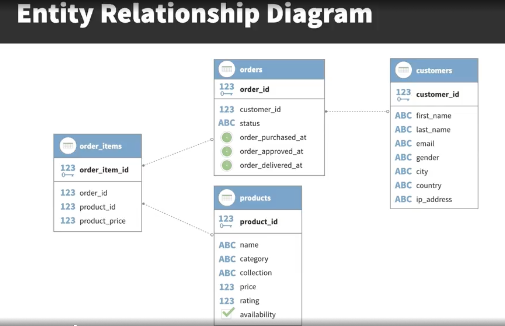
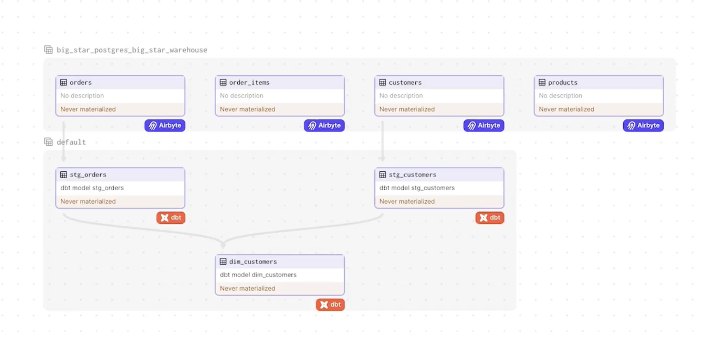

# End-to-End Data Engineering Project using Dagster and Aribyte

The world of data engineering is ever-changing, with new tools and technologies emerging regularly. Building an effective analytics platform can be a daunting task, especially if you’re not familiar with all the tools available. How do you turn scattered, complex data into a model that drives insights and decision-making?

## Project Overview

In this project, we implemented an end-to-end data engineering pipeline using open tools from the modern data stack. The project focused on transforming scattered, complex data into a unified, analytics-ready format for a fictional ecommerce company. 

### Key Objectives
- **Data Modeling:** Structured the data to ensure optimal storage and query performance.
- **Data Transformation:** Extracted, loaded, and transformed data using best practices to prepare it for analytics.
- **Testing and Documentation:** Implemented rigorous testing and documentation to ensure data quality and maintainability.
- **Version Control:** Managed the project through efficient version control practices.

## Tools and Technologies Used
- **Airbyte:** For seamless data extraction from various sources.
- **Dagster:** To orchestrate and manage complex data pipelines.
- **dbt:** For transforming data into an analytics-ready state.
- **Google Cloud Platform (GCP):** Hosted the infrastructure and provided scalable cloud services.
- **Docker:** Enabled containerization for consistent and reproducible environments.
- **PostgreSQL:** Used as the primary database for storing processed data.

## Learning Outcomes
By working on this project, I gained hands-on experience with building and managing data engineering pipelines, from ingestion to transformation, using modern tools and best practices. This project also helped me develop a deeper understanding of the data engineering lifecycle and how to effectively turn complex data into valuable insights.

## Visuals

### Entity Relationship Diagram

### DBT Orchestration

